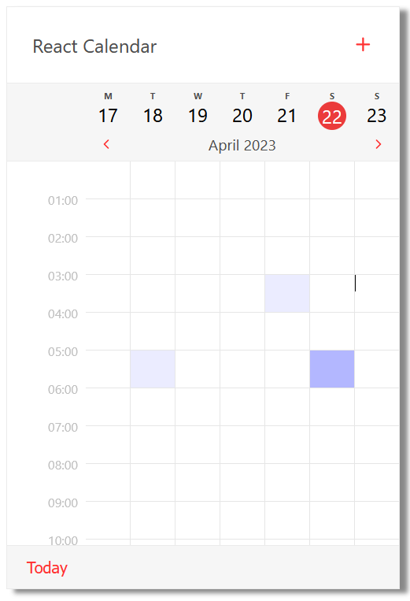
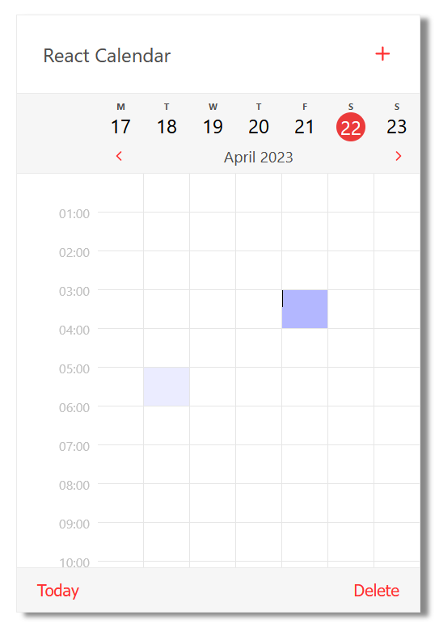
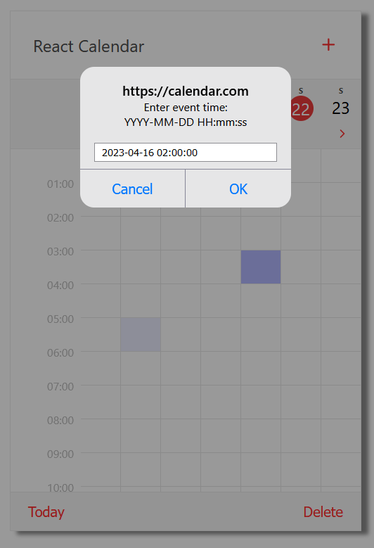

# React Project - Mobile calendar

Stack: **React**, **styled-components**, **Typescript**, **Redux**

`Main screen`

`Delete event`

`Add event`

Demo
-
> https://cloud-art.github.io/mobileCalendar/